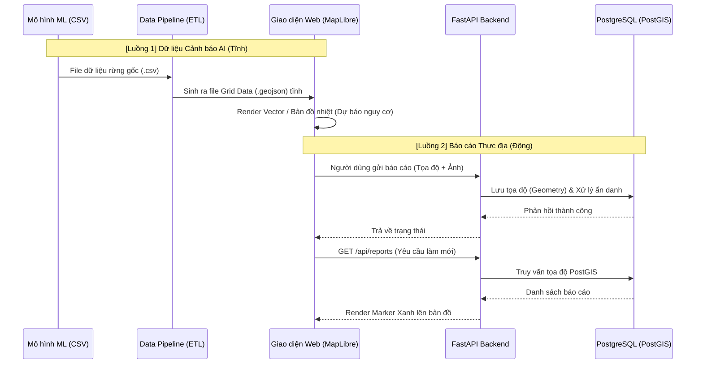

# Luồng Dữ Liệu & Hiển Thị (Data Flow Architecture)

Tài liệu này mô tả chi tiết luồng dữ liệu (Data Flow) của Hệ thống Web GIS Cảnh báo Mất rừng Gia Lai, từ lúc dữ liệu thô được tiếp nhận cho đến khi hiển thị và tương tác trên bản đồ (Frontend). Mục tiêu của tài liệu này là giúp nhóm dễ dàng kiểm chứng cơ chế hoạt động để tự tin trình bày trước hội đồng giám khảo cuộc thi.

---

## 1. Tổng Quan Luồng Dữ Liệu (High-Level Data Flow)

Hệ thống của chúng ta hoạt động với 2 luồng dữ liệu chính chạy song song và kết hợp trên giao diện bản đồ:
- **Luồng 1 (Dữ liệu Tĩnh - Dự báo AI):** Dữ liệu phân tích nguy cơ mất rừng từ mô hình Machine Learning/thống kê (dạng CSV) được chuyển đổi và hiển thị lên bề mặt bản đồ.
- **Luồng 2 (Dữ liệu Động - Crowdsourcing):** Dữ liệu thu thập từ người dùng (báo cáo thực địa, ảnh chụp) được gửi về máy chủ, lưu vào Database và trả lại lên bản đồ theo thời gian thực.

---

## 2. Chi Tiết Luồng 1: Dữ liệu Dự Đoán Nguy Cơ (AI Analytics Flow)

Đây là giá trị cốt lõi của dự án dành cho cuộc thi. Việc hiển thị dữ liệu cảnh báo rừng được thực hiện tối ưu qua các bước:

### Bước 2.1. Đầu vào (Input)
Kết quả chạy từ mô hình Machine Learning được xuất ra dưới dạng bảng `.csv`. 
Dữ liệu này chứa tọa độ (Vĩ độ, Kinh độ) và các thuộc tính liên đới tới rủi ro mất rừng:
- **Elevation** (Độ cao)
- **Slope** (Độ dốc)
- **Tree Cover 2000** (Độ che phủ rừng)
- **Annual Rainfall** (Lượng mưa trung bình)
- Các chỉ số khác (NDVI, Loss Year...)

### Bước 2.2. Tiền xử lý (Data Pipeline)
Hệ thống sử dụng Python script (`data-pipeline/csv_to_geojson.py`) để làm nhiệm vụ ETL (Extract, Transform, Load):
1. **Extract:** Đọc tệp `.csv`.
2. **Transform:** Chuyển đổi ma trận tọa độ thành các khối định dạng không gian (Geometry Points/Polygons). Đóng gói toàn bộ các cột thuộc tính vào `properties` của từng khối.
3. **Load:** Lưu xuất thành tệp `grid_data.geojson` và đặt trực tiếp vào thư mục `public/data/` của Frontend để sẵn sàng được phục vụ (serve) nhanh nhất mà không phải qua Database.

### Bước 2.3. Hiển thị & Tương tác (Frontend Visualization)
Khi người dùng truy cập web:
1. **Load Bản Đồ:** Next.js sẽ load thư viện `MapLibre GL JS` và tải file `.geojson` trên về trình duyệt.
2. **Render Bản Đồ Cảnh Báo:** MapLibre sẽ vẽ dữ liệu lên màn hình theo các Layer (có thể là điểm - Circle Layer hoặc Heatmap) phụ thuộc vào thông số `Nguy cơ rủi ro`.
3. **Bộ lọc tương tác (Realtime Filtering):** Đây là điểm "Ăn Tiền" của hệ thống. Người dùng sử dụng 4 thanh trượt (Sliders): *Độ dốc, Độ cao, Che phủ, Lượng mưa*.
   - Mỗi khi kéo thanh trượt, một biểu thức lọc (`filterExpression`) được kích hoạt.
   - MapLibre so sánh biểu thức này với `properties` của file GeoJSON ngay trên trình duyệt (Client-side) ở tốc độ 60 khung hình/giây.
   - Lớp cảnh báo sẽ tự động biến mất/xuất hiện để lọc ra những khu vực "thỏa mãn" các điều kiện ngoại cảnh gây mất rừng.

---

## 3. Chi Tiết Luồng 2: Dữ liệu Đóng góp Cộng đồng (Crowdsourcing Flow)

Để minh chứng tính ứng dụng thực tế, người dùng (Kiểm lâm, người dân) có thể báo cáo khi thấy rừng bị chặt phá.

### Bước 3.1. Gửi Báo Cáo
1. Người dùng nhấp (click) vào bản đồ tại khu vực nghi ngờ bị tàn phá.
2. Một Form điền thông tin hiện lên yêu cầu: Lời nhắn (Comment) & Ảnh chụp hiện trường (Image).
3. Frontend dùng `FormData()` đóng gói dữ liệu và tọa độ gửi qua HTTP `POST /api/reports` đến Backend (FastAPI).

### Bước 3.2. Xử lý tại Backend
1. **Xử lý Ảnh:** FastAPI tiếp nhận và kiểm tra định dạng ảnh (chỉ nhận `png/jpg`), tự động tải và lưu tệp tĩnh vào thư mục `uploads/` trên máy chủ.
2. **Bảo mật & Ẩn danh:** Địa chỉ IP của người gửi bị băm (Hash) một chiều trộn cùng `SALT` mật nhằm bảo vệ quyền riêng tư người báo cáo theo quy chuẩn bảo mật.
3. **Lưu Không Gian (Spatial Storage):** Tọa độ Kinh độ, Vĩ độ được gói vào kiểu `WKTElement` và lưu xuống CSDL PostgreSQL (với Extension PostGIS).

### Bước 3.3. Hiển thị Lại Lên Bản Đồ
1. Ngay khi lưu thành công, Frontend tự động gửi một tín hiệu lấy lại dữ liệu mới (`GET /api/reports`).
2. Backend truy vấn `PostGIS` để lấy danh sách toàn bộ báo cáo, giải mã `Geometry` ngược về kinh/vĩ độ, và gửi lại mảng dữ liệu.
3. Frontend nhận dữ liệu, tạo ra các "Marker Cảnh Báo màu Xanh" ghim trực tiếp lên bản đồ.
4. Khi Ban giám khảo/User nhấp vào Marker, một Popup sẽ mở ra hiển thị thời gian, Ảnh chụp và Comment của báo cáo đó.

---

## 4. Tóm tắt Kiểm Chứng (Verification Checklist cho Cuộc thi)
Để thuyết trình thuyết phục, nhóm nên kiểm chứng và trình bày theo Flow sau:
- [ ] **Data Check:** Chỉ ra file `.csv` gốc của mô hình ML sinh ra, và file `.geojson` đã được pipeline xử lý.
- [ ] **Interactive Check:** Kéo thả 4 thanh trượt (Slider) để giám khảo thấy vùng nguy cơ trên bản đồ thay đổi ngay lập tức dựa trên thông số sinh học/địa lý. (Minh chứng dữ liệu hiển thị là dữ liệu thật từ mô hình chứ không phải ảnh tĩnh).
- [ ] **Live Action:** Trực tiếp click vào một khu rừng, upload một bức ảnh và viết ghi chú. Sau đó tải lại trang để thấy hệ thống CSDL không gian hoạt động ổn định và ảnh được trả về.
