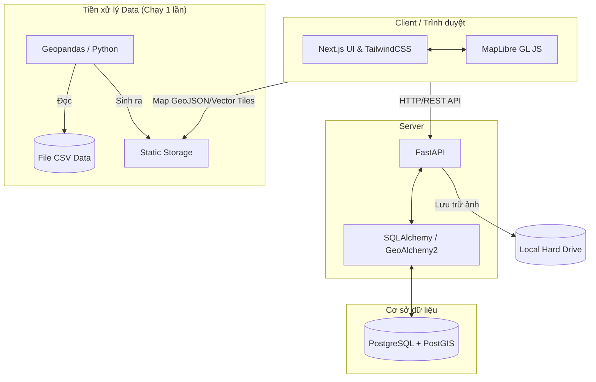

# Tài liệu Yêu cầu Kỹ thuật (TRD) & Kiến trúc Hệ thống

Mục tiêu của tài liệu này là xác định rõ kiến trúc hệ thống, các lựa chọn kỹ thuật chi tiết và cấu trúc thư mục để phát triển Nền tảng Bản đồ Cảnh báo Mất rừng Gia Lai. Nền tảng này sẽ được đặt trong một thư mục hoàn toàn độc lập với phần code Machine Learning hiện tại.

## 1. Kiến trúc Hệ thống (System Architecture)

Hệ thống được thiết kế theo kiến trúc **Client-Server** kết hợp với **Spatial Database**, đảm bảo khả năng xử lý bản đồ mượt mà và lưu trữ tọa độ check-in. Cả Frontend và Backend sẽ được deploy trên cùng 1 server.



### Các thành phần chính:
1. **Frontend (Next.js):** Quản lý giao diện, các tab, slider, và hiển thị bản đồ bằng MapLibre GL JS. Tương tác với người dùng.
2. **Backend (Python - FastAPI):** Xử lý logic upload ảnh (lưu trực tiếp lên ổ cứng), nhận comment, hash IP để ẩn danh, và truy vấn các điểm check-in từ Database gửi lên Frontend. FastAPI được chọn vì hiệu năng cao, hỗ trợ Async và tài liệu API tự động (Swagger).
3. **Database (PostgreSQL + PostGIS):** Cơ sở dữ liệu quan hệ mạnh mẽ, lưu trữ tọa độ check-in dưới dạng điểm không gian (Geometry Point).
4. **Data Pipeline:** Script chạy độc lập (chạy 1 lần hoặc khi có data mới). Đọc các file `CSV` -> Sinh ra các file GeoJSON tĩnh -> Đưa vào thư mục tĩnh của Frontend để render bản đồ 1km.

---

## 2. Yêu cầu Kỹ thuật (Technical Requirements)

### 2.1. Cấu trúc thư mục dự án
Toàn bộ mã nguồn web được cô lập trong thư mục `web-gis/` nằm ở thư mục gốc của project hiện tại.
```text
deforestation-risk-ai/
├── data/                  # Dữ liệu ML hiện tại
├── docs/                  # Tài liệu ML hiện tại
├── web-gis/               # THƯ MỤC DÀNH CHO WEBSITE
│   ├── docs/              # Tài liệu của riêng website
│   ├── frontend/          # Mã nguồn Next.js (React)
│   ├── backend/           # Mã nguồn Python Backend (FastAPI)
│   └── data-pipeline/     # Các script Python xử lý CSV -> Bản đồ
└── ...
```

### 2.2. Frontend Specifications
*   **Framework:** Next.js (App Router).
*   **Ngôn ngữ:** TypeScript để đảm bảo code an toàn.
*   **Styling:** TailwindCSS để dựng giao diện nhanh.
*   **Bản đồ:** MapLibre GL JS (mã nguồn mở, miễn phí 100%, không yêu cầu API key như Mapbox).
*   **Quản lý State:** React Hooks mặc định.

### 2.3. Backend Specifications (Python FastAPI)
*   **Framework:** FastAPI.
*   **Database ORM:** SQLAlchemy kết hợp GeoAlchemy2 (để xử lý dữ liệu PostGIS).
*   **Bảo mật & Spam Check:**
    *   Sử dụng thư viện `hashlib` để băm (hash) IP address của user + một chuỗi `SALT` bí mật. Chỉ lưu chuỗi Hash vào Database để đảm bảo tính ẩn danh.
*   **Xử lý Upload Ảnh:** API nhận file multipart, kiểm tra định dạng (chỉ cho phép .jpg, .png), resize giảm dung lượng (dùng thư viện `Pillow`) và lưu trực tiếp vào thư mục `uploads/` trên ổ cứng của Server chạy Backend (trả về URL).

### 2.4. Database Schema (PostgreSQL)
Cần có một bảng chính để lưu Check-in:
*   `table: field_reports`
    *   `id` (UUID hoặc Integer, Primary Key)
    *   `geom` (PostGIS Geometry, POINT, tọa độ check-in)
    *   `comment` (Text)
    *   `image_url` (Varchar, link ảnh local)
    *   `user_ip_hash` (Varchar, IP đã băm)
    *   `created_at` (Timestamp)

### 2.5. Data Pipeline Specifications
Script Python thực hiện các bước:
1. Đọc file CSV hiện tại.
2. Dựa vào `lat`, `lon`, tạo các hình học Point (Chấm).
3. Đưa các thuộc tính (NDVI, Rain, Loss Year, Elevation...) vào Properties của mỗi hình học.
4. Xuất ra tệp `grid_data.geojson`. 

---

## 3. Kế hoạch Deploy trên 1 Server
Vì cả Frontend và Backend sẽ chạy trên cùng một máy chủ (Server), luồng hoạt động sẽ như sau:
1. **Tiền xử lý Data:** Chạy file `csv_to_geojson.py` để tạo ra tệp `.geojson` đặt trong thư mục `public` của Frontend.
2. **Backend:** Chạy FastAPI bằng `uvicorn` (hoặc `gunicorn` trên production) ở cổng 8000. Dịch vụ này sẽ kết nối thẳng tới PostgreSQL (cùng nằm trên server này hoặc qua VPN).
3. **Frontend:** Build Next.js và chạy ở cổng 3000. Cấu hình Frontend gọi API tới `http://localhost:8000`.
4. **Nginx:** Sử dụng Nginx làm Reverse Proxy để trỏ domain (VD: `gialai-forest-risk.com`) tới cổng 3000, và cấu hình route `/api` trỏ về cổng 8000.
